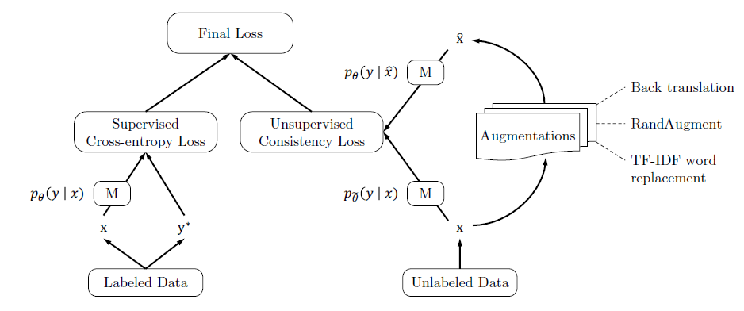
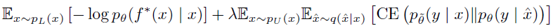

# Semi_supervised_deep_CNN
Implémentation de l'article "Unsupervised Data Augmentation for Consistency Training" de Xie et al. https://arxiv.org/pdf/1904.12848.pdf sur le jeu de données MNIST sous python.  

Le but de l'article est d'obtenir de bonnes performances de classification dans un contexte semi-supervisé à l'aide de data augmentation, la méthode proposée peux se résumer par la représentation suivante :

  

La fonction de perte finale est donc un mélange ( plus précisément une somme pondérée ) d'une première perte supervisé et d'une seconde perte non supervisée se calculant à l'aide d'une entropie croisée. Plus précisément la fonction de perte finale à minimiser selon $\theta$ s'écrit :  

  

Avec $p_L$ la densité des données labélisées, $p_U$ la densité des données non labélisées,  $q(.|x)$ la densité des augmentations partant de la donnée x, $f^*(x)$ la classe de x et $\lambda$ un hyper-paramètre représentant l'importance accordé à la partie augmentée.  

Ce repo est un travail en commun contenant une présentation de la méthode et des performances obtenues ainsi qu'un code sous python permétant d'implémenter cette technique sur les données MNIST. Nous nous sommes restreint à 1000 images MNIST pour la partie supervisée et avons utilisés le reste du train pour la partie data augmentation.  

Nous avons entrainer deux types de réseaux de neuronnes, un réseau de neuronnes dense et un réseau de convolution. Nous avons ensuite appliqués la méthode de l'article au lieu de les entrainer uniquement sur les données labélisées ( 1000 images )et avons remarquer une augmentation de l'accuracy. Le but ici n'était pas d'avoir des réseaux performant mais uniquement de remarquer une augmentation de l'accuracy grace à la méthode proposer par l'article.  

Le tableau suivant résume une partie des résultats obtenus :  

| Modèle |  Méthode supervisé |  Méthode semi-supervisé |  Gain d'accuracy |  
|-----------|-----------|-----------| -----------| 
| Réseau dense |  72.80% | 79.82% | 7.02% |  
| CNN  |  73.80%  |  76.52% | 2.72% | 
